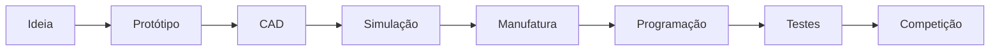

<div align="center">

# ⚙️ SESI Robotics Team

### *Engineering the Future Through Robotics, Innovation & Impact.*


</div>

---

<div align="center">


</div>

---

# 🚀 Sobre Nós

Somos uma equipe de robótica do **SESI**, formada por estudantes apaixonados por engenharia, tecnologia e inovação.

Participamos de competições nacionais e internacionais como:

- 🏆 FIRST Robotics Competition (FRC)
- 🤖 FIRST Tech Challenge (FTC)
- 🇧🇷 Olimpíada Brasileira de Robótica (OBR)

Nossa equipe atua no desenvolvimento de soluções avançadas envolvendo:

- Sistemas embarcados
- Inteligência artificial
- Visão computacional
- CAD e manufatura
- Automação
- Estratégia competitiva
- Projetos sociais e educacionais

---

# 🌌 Missão

Desenvolver talentos capazes de transformar tecnologia em impacto social através da robótica.

# 🎯 Visão

Ser referência nacional em robótica educacional, engenharia competitiva e inovação tecnológica.

# 💡 Valores

- Trabalho em equipe
- Excelência técnica
- Inovação contínua
- Impacto social
- Liderança
- Colaboração
- Ética e profissionalismo

---

# ⚡ Tecnologias & Ferramentas

<div align="center">


</div>

---

# 📊 GitHub Analytics

<div align="center">


</div>

---

# 🧠 Áreas Técnicas

| Área | Descrição |
|---|---|
| 🤖 Programação | Sistemas autônomos, visão computacional e controle |
| ⚙️ Mecânica | Estruturas competitivas e manufatura |
| 🧩 CAD | Modelagem 3D e engenharia reversa |
| 🔌 Eletrônica | PCBs, sensores e integração |
| 🛰️ Automação | Sistemas inteligentes e telemetria |
| 📢 Marketing | Branding, mídia e impacto social |
| 📚 Projetos Sociais | Oficinas STEM e educação tecnológica |

---

# 🏗️ Projetos em Destaque

## 🤖 Titan-X Competition Robot

Robô modular de competição desenvolvido para desafios FRC.

### Tecnologias
- Java
- WPILib
- Vision Processing
- CAD
- CNC

---

## 🧠 VisionCore AI

Sistema de visão computacional para rastreamento inteligente.

### Tecnologias
- Python
- OpenCV
- YOLO
- TensorFlow

---

## 📡 RoboTelemetry

Dashboard em tempo real para monitoramento do robô.

### Recursos
- Telemetria
- Diagnóstico remoto
- Logs automáticos
- Dashboard Web

---

# 🏆 Competições

| Ano | Competição | Resultado |
|---|---|---|
| 2026 | FRC Regional | 🥇 Finalista |
| 2025 | FTC National | 🥈 Inspire Award |
| 2025 | OBR Nacional | 🏅 Destaque Técnico |

---

# 📈 Linha do Tempo

```text
2019 ─ Fundação da Equipe
2020 ─ Primeiros Projetos STEM
2021 ─ Entrada na FTC
2022 ─ Expansão Técnica
2023 ─ Projetos Sociais
2024 ─ Participação Nacional
2025 ─ Internacionalização
2026 ─ Laboratório Avançado de Robótica
```

---

# 🌍 Impacto Social

- Oficinas gratuitas de robótica
- Inclusão tecnológica
- Formação STEM
- Mentoria para escolas
- Projetos educacionais
- Divulgação científica

---

# 🏢 Estrutura Organizacional

```text
Capitão Geral
│
├── Engenharia Mecânica
├── Programação
├── Eletrônica
├── CAD & Design
├── Estratégia
├── Marketing
└── Projetos Sociais
```

---

# 🔄 Processo de Desenvolvimento



---

# 🛠️ Como Contribuir

```bash
# Fork do projeto
git fork

# Clone
git clone https://github.com/SEU_TIME/projeto.git

# Nova branch
git checkout -b feature/nova-feature

# Commit
git commit -m "feat: nova funcionalidade"

# Push
git push origin feature/nova-feature
```

---

# 🤝 Parceiros & Patrocinadores

<div align="center">

</div>

---

# 👨‍💻 Equipe

| Nome | Área | Função |
|---|---|---|
| João Silva | Programação | Capitão |
| Maria Souza | CAD | Engenharia |
| Lucas Lima | Eletrônica | Sistemas |
| Ana Costa | Marketing | Comunicação |

---

# 🌐 Redes Sociais

<div align="center">

[](https://instagram.com)
[](https://linkedin.com)
[](https://youtube.com)

</div>

---

# 📫 Contato

📩 robotics@sesi.org.br

🌎 www.sesi.org.br

---

<div align="center">

## ⚡ "Construindo tecnologia que inspira pessoas."


</div>
